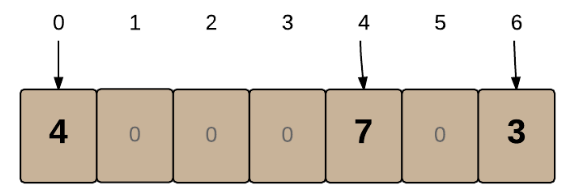
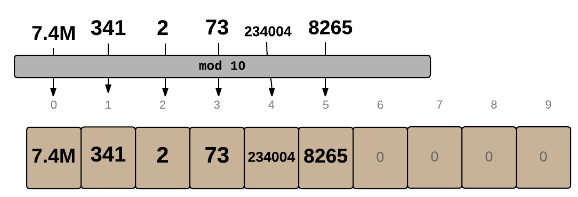
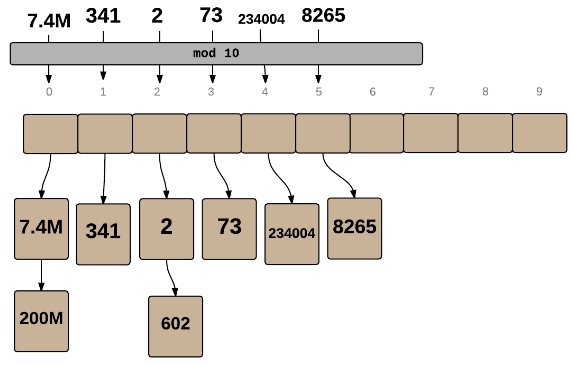

## How to solve this challenge?

1. Read the "Challenge description" below.
2. Make changes to the [challenge.js](./challenge.js) file.
3. Commit your changes.
4. Wait for the result of the "GitHub Classroom Workflow" action. If it is green - congratulations, you solved this challenge! If not - try again!
5. *You can watch an example of how to solve a challenge in the video linked in the theoretical lesson preceding this challenge.*

## Challenge description

### HashTables
Maps and Sets provide a clean interface for accessing or looking up the elements within them. There are a number of different ways in which they can be implemented, but the most common one uses a technique known as hashing.

- **Q:** What is Hashing and what makes it so special?
- **A:** A program usually needs to check through multiple elements in a collection to find a single element, but hashing lets it find items immediately, regardless of the size of the collection!
- **Q:** How does hashing do that?
- **A:** Let's see by implementing a basic HashTable.

### Implementing a HashTable
Let's say you have a set of integer keys which map to values and you want to create a structure that can find and modify the values in constant time.
If your set of keys was just a small range of integers, a HashMap would not be necessary since you could use a simple array to store the values, with the index values of the array as 'keys':



In the above array, 0 'maps' to 4 and 4 'maps' to 7. You can create a new 'mapping' for any key k (where k is less than the array's length) by simply updating kth cell in the array with the value you want.

However, if the range of keys is large, an array would need to use up a lot of memory in order to store everything. For example, it would be very inefficient to create an Array of length 200M (200 Million) just to store the following 7 items:

2, 341, 73, 8265, 234004, 7.4M, 200M

**Mini-challenge**: Can you think of a simple way to convert the above data so it can be stored in a small array, say of size 10?

#### Solution
We can use the mod operator % on a number to get a remainder r and store the element in index r of the array. For example, if we did mod 10 on each number, we would get the following remainders:

2, 1, 3, 5, 4, 0, 0

We can then store the values in an array of size 10:



Note that 200M didn't make it to the array, since the 0 cell was already occupied. When two keys end up at the same index, there's a collision. The simplest way to resolve collisions is to create a List at each location in the array, so multiple items can be stored. As long as collisions are rare, we'll still be able to find every item quickly.



In the above case, for every number n, we did n % 10 to find the location of the element. This function is known as the Hash Function. Real-world hash functions are more complicated, but the purpose is to convert a number of any size to a number contained within a small range of values while avoiding too many collisions.

- **Q:** What if the data we're using as keys is not a number?
- **A:** All data is represented as numbers in some manner in a computer, so the computer can use those numbers in the hash function. The key idea of the hash function is to use the actual value of an item to find the item in an array.

### Challenge
1. Create your own list-based hash table with n mod 11 as the hash function for each number n. Always use the absolute value of n.
2. Given a list of numbers, hash them all into the hash table.
3. Return an array with the numbers in the order that they appear in the hash table. 

#### Sample Input
```javaScript
[12, 24, 125, 5, 91, 1106, 2, 1021, 29, 3536, 10]
```
#### Sample Output
```javaScript
[12, 24, 2, 91, 125, 5, 3536, 1106, 29, 1021, 10]
```
The hash table will look like this at the end:
```javaScript
0  1  2  3  4  5  6   7   8   9   10  //index
. 12 24 91 125 5 1106 29  . 1021  10  //values
      2       3536
```
### Example
```javaScript
hashTable([12, 24, 125, 5, 91, 1106, 2, 1021, 29, 3536, 10])
// => [12, 24, 2, 91, 125, 5, 3536, 1106, 29, 1021, 10]
```


### Troubleshooting

If you cannot see any auto-grading workflows on the [Actions](../../actions) page, learn how to fix it in [this repo](https://github.com/microverse-students/autograding-troubles-js/blob/main/README.md).
