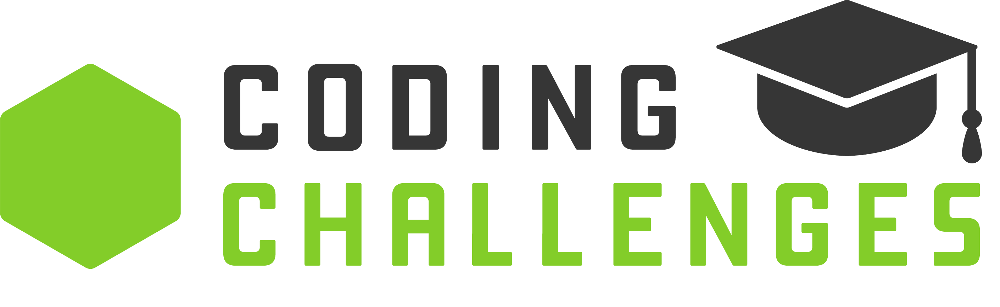

<a name="readme-top"></a>

<div align="center">
    
</div>

---

<!-- * TABLE OF CONTENTS -->

# 📗 Table of Contents

- [📖 About the Repo](#about-repo)
  - [Languages](#languages)
- [💻 Getting Started](#getting-started)
  - [Setup](#setup)
  - [Prerequisites](#prerequisites)
- [👥 Authors](#authors)
- [🤝 Contributing](#contributing)
- [⭐️ Show your support](#support)

---

<!-- * REPO DESCRIPTION -->

# 📖 Coding Challenges <a name="about-repo"></a>

Throughout my learning journey, I have amassed a collection of coding challenges that I've tackled and stored. I continually engage with these challenges as I explore new programming languages and technologies. This repository reflects my commitment to honing my coding skills and problem-solving abilities. It's a dynamic resource, showcasing my growth and adaptability in the ever-evolving world of technology. I aim to diversify the range of challenges, document my solutions, and actively seek opportunities for improvement.

I'd like to mention that there were more coding challenges I've solved on various online platforms, but I didn't store them here. Nevertheless, these challenges have contributed significantly to my learning journey.

Collaborating with others, setting clear goals, and sharing knowledge are all essential components of my ongoing journey to become a proficient programmer.

### Languages <a name="languages"></a>

  <ul>
    <li>
      <a href="https://developer.mozilla.org/en-US/docs/Web/JavaScript">
        
      </a>
    </li>
    <li>
      <a href="https://www.ruby-lang.org/en/">
        
      </a>
    </li>
    <li>
      <a href="https://www.w3schools.com/c/c_intro.php">
        
      </a>
    </li>
    <li>
      <a href="https://www.python.org/">
        
      </a>
    </li>
    <li>
      <a href="https://www.sqlite.org/index.html">
        
      </a>
    </li>
  </ul>

<p align="right">(<a href="#readme-top">back to top</a>)</p>

---

<!-- * GETTING STARTED -->

## 💻 Getting Started <a name="getting-started"></a>

To get a local copy up and running, follow these steps.

### Prerequisites

In order to run this project you need:

### Setup

Clone this repository to your desired folder:

Example commands:

- With SSH:

```bash
  cd your-folder
  git clone git@github.com:ITurres/coding-challenges.git
```

- With HTTPS:

```bash
  cd your-folder
  git clone https://github.com/ITurres/coding-challenges.git
```

- With GitHub CLI:

```bash
  cd your-folder
  gh repo clone ITurres/coding-challenges
```

<p align="right">(<a href="#readme-top">back to top</a>)</p>

---

<!-- * AUTHORS -->

## 👥 Authors <a name="authors"></a>

👤 **Arthur Iturres**

- GitHub: [@ITurres](https://github.com/ITurres)
- LinkedIn: [Arthur Emanuel G. Iturres](https://www.linkedin.com/in/arturoemanuelguerraiturres/)
- Angellist / Wellfound: [Arturo (Arthur) Emanuel Guerra Iturres](https://wellfound.com/u/arturo-arthur-emanuel-guerra-iturres)
- Youtube: [Arturo Emanuel Guerra Iturres - Youtube Channel](https://www.youtube.com/channel/UC6GFUFHOtBS9mOuI8EJ6q4g)
- Portfolio: [Arthur Iturres - Portfolio](https://iturres.github.io/iturres-reactive-portfolio/)

<p align="right">(<a href="#readme-top">back to top</a>)</p>

---

<!-- * CONTRIBUTING -->

## 🤝 Contributing <a name="contributing"></a>

Contributions, issues, and feature requests are welcome!

Feel free to check the [issues page](https://github.com/ITurres/coding-challenges/issues).

<p align="right">(<a href="#readme-top">back to top</a>)</p>

---

<!-- * SUPPORT -->

## ⭐️ Show your support <a name="support"></a>

Give a ⭐ if you liked this project!

<p align="right">(<a href="#readme-top">back to top</a>)</p>

---
