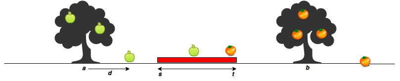

# Count Apples and Oranges

Sam's house has an apple tree and an orange tree that yield an abundance of fruit. Using the information given below, determine the number of apples and oranges that land on Sam's house.

In the diagram below:

- The red region denotes the house, where is the start point, and _**t**_ is the endpoint. The apple tree is to the left of the house, and the orange tree is to its right.
- Assume the trees are located on a single point, where the apple tree is at point _**a**_, and the orange tree is at point _**b**_.
- When a fruit falls from its tree, it lands _**d**_ units of distance from its tree of origin along the _**x**_-axis. \*A negative value of _**d**_ means the fruit _**d**_ fell units to the tree's left, and a positive value of _**d**_ means it falls _**d**_ units to the tree's right.



Given the value of _**d**_ for _**m**_ apples and oranges, determine how many apples and oranges will fall on Sam's house (i.e., in the inclusive range _**[s,t]**_ )?

For example, Sam's house is between and _**s**_ **= 7**. The apple tree is located at _**a**_ **= 4** and the orange at _**b**_ **= 12**. There are _**m**_ **= 3** apples and _**n**_ **= 3** oranges. Apples are thrown _**apples**_ **= [2,3,-4]** units distance from _**a**_ , and _**oranges**_ **= [3,-2,-4]** units distance. Adding each apple distance to the position of the tree, they land at **[4+2,4+3,4+-4] = [6,7,0]**. Oranges land at **[12+3,12+-2,12+-4] = [15,10,8]**. One apple and two oranges land in the inclusive range **7 - 10** so we print

```text
1
2
```

## Function Description

Complete the countApplesAndOranges function in the editor below. It should print the number of apples and oranges that land on Sam's house, each on a separate line.

countApplesAndOranges has the following parameter(s):

_**s**_: integer, starting point of Sam's house location.
_**t**_: integer, ending location of Sam's house location.
_**a**_: integer, location of the Apple tree.
_**b**_: integer, location of the Orange tree.
_**apples**_: integer array, distances at which each apple falls from the tree.
_**oranges**_: integer array, distances at which each orange falls from the tree.

### Input Format

The first line contains two space-separated integers denoting the respective values of _**s**_ and _**t**_.
The second line contains two space-separated integers denoting the respective values of _**a**_ and _**b**_.
The third line contains two space-separated integers denoting the respective values of _**m**_ and _**n**_.
The fourth line contains _**m**_ space-separated integers denoting the respective distances that each apple falls from point _**a**_.
The fifth line contains _**n**_ space-separated integers denoting the respective distances that each orange falls from point _**b**_.

Constraints

- 1 <= _**s,t,a,b,m,n**_ <= 10<sup>5</sup>
- -10<sup>5</sup> <= _**d**_ <= 10<sup>5</sup>
- _**a**_ < _**s**_ < _**t**_ < _**b**_

### Output Format

Print two integers on two different lines:

1- The first integer: the number of apples that fall on Sam's house.
2- The second integer: the number of oranges that fall on Sam's house.

#### Sample Input 0

```text
7 11
5 15
3 2
-2 2 1
5 -6
```

#### Sample Output 0

```text
1
1
```

---
